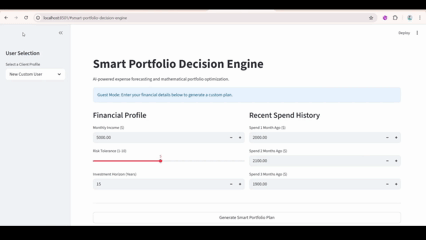
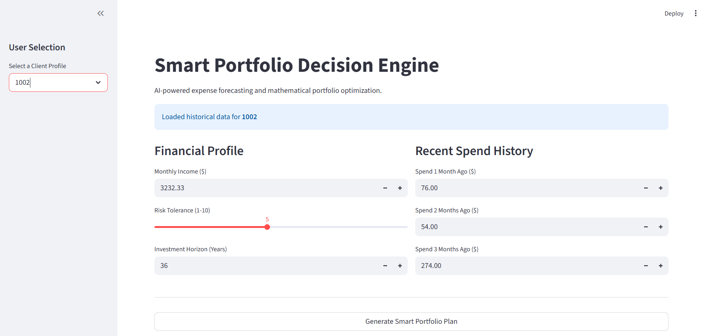
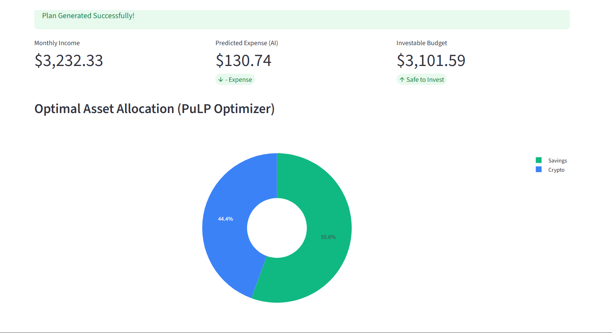
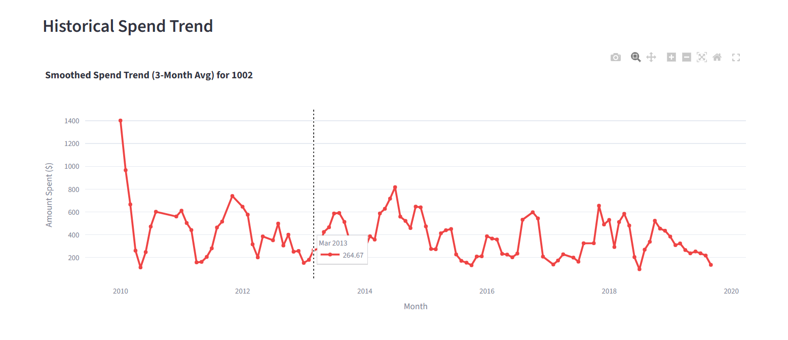
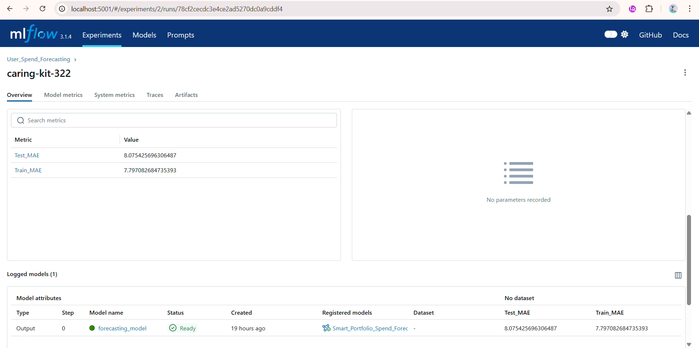
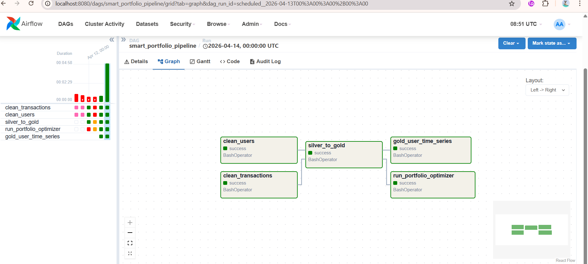

# 🧠 Smart Portfolio Engine

An end-to-end AI-powered system that forecasts user spending and optimally allocates disposable income across financial assets using machine learning and mathematical optimization.

---

## 📌 Overview

This project goes beyond a traditional ML model. It is a full pipeline that combines:

- Data Engineering (Medallion Architecture)
- Machine Learning (Time-Series Forecasting)
- Operations Research (Linear Programming)
- Backend APIs (FastAPI)
- Frontend Dashboard (Streamlit)

The system predicts a user's future expenses and calculates the optimal investment allocation based on risk preferences and constraints.

---

## 🏗️ Architecture

- **Bronze Layer**: Raw ingestion (IBM synthetic financial dataset)
- **Silver Layer**: Cleaned and structured transaction data
- **Gold Layer**: Feature-engineered dataset for modeling
- **ML Layer**: XGBoost model for expense forecasting
- **Optimization Layer**: PuLP-based linear programming engine
- **Serving Layer**: FastAPI + Streamlit

---

## ⚙️ Key Features

- 📊 Time-series forecasting of monthly expenses
- 🧮 Portfolio optimization using linear programming
- 🔄 Automated pipelines with Airflow
- 📦 Model tracking and versioning with MLflow
- 🌐 REST API for real-time predictions
- 🖥️ Interactive dashboard for end users

---

## 🧠 Core Insight

Initial modeling failed due to high volatility in the dataset.  

Upon deeper analysis:
- Data was dominated by **B2B industrial transactions**
- Spending patterns showed **lumpy demand**, not retail behavior

### Solution:
- Refined definition of discretionary spending
- Applied **rolling 3-month smoothing** (target engineering)

📉 Result:
- Mean Absolute Error reduced from **249 → 11**

---

## 🛠️ Tech Stack

| Layer                | Tools Used |
|---------------------|-----------|
| Data Engineering     | PySpark, Delta Lake |
| Orchestration        | Apache Airflow |
| Machine Learning     | XGBoost, MLflow |
| Optimization         | PuLP (Linear Programming) |
| Backend              | FastAPI |
| Frontend             | Streamlit |
| Visualization        | Plotly |

---

## 🚀 Demo

### 🎥 Application Walkthrough


---

## 📸 Screenshots

### Dashboard


### User Input & Forecast


### Optimization Output


### Allocation Visualization


### System Flow / Pipeline


---

## How to Run
```bash
git clone https://github.com/your-username/smart-portfolio-engine.git
cd smart-portfolio-engine
pip install -r requirements.txt
uvicorn src.api.app:app --reload
streamlit run streamlit_app.py
```
